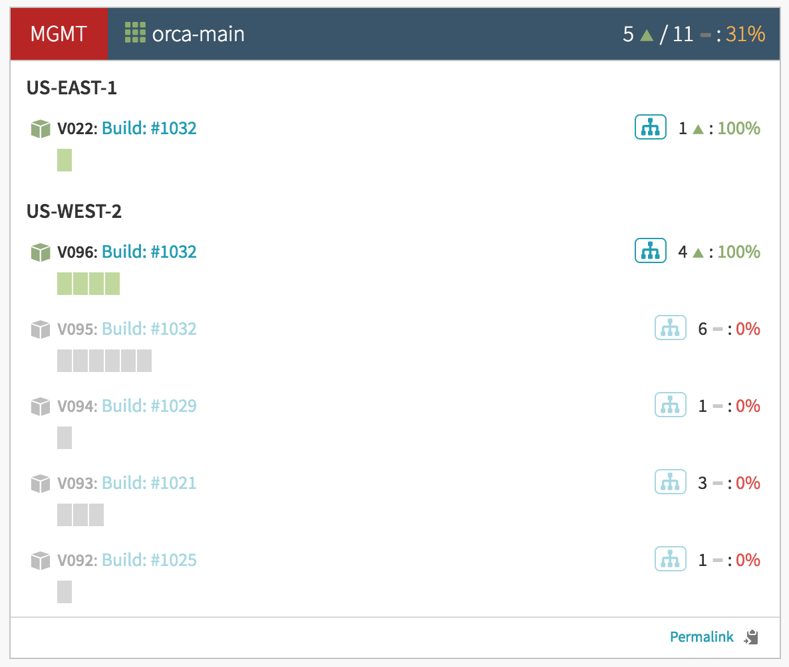

# orca-reaper

A script to that can be used to gracefully terminate Spinnaker Orca instances.

Spinnaker's orchestration service, Orca, currently uses Spring Batch which
makes it a stateful service that will lose track of executions in the event of
a node loss or process restart. This can make deployment operations difficult if
your organization doesn't have a reaper in place.

This script is an open source adaptation of the reaper we use at Netflix to
perform red/black deployments for Orca. Internally, we check for the number of
execution invocations on a per-instance basis, and once an Orca instance has 0
invocations, we know it has been drained and can be safely terminated. 

Your Orca deployment should be performed via red/black, keeping disabled Orca
servers until they are terminated by this script. We run our reaper job every
60 minutes, but your milage may vary.

Assuming you deploy as often as we do, you might see something like this:

